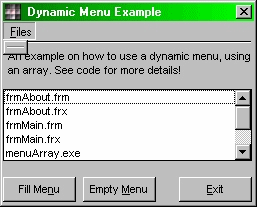

## Dynamic Menu

### Description

Dynamic Menu example for everyone! Heavily commented!! This code teach you how to load/unload menu items at run-time, how to add all file names (without the .*** extension) from a directory to a menu. You will find that all this is really not that difficult if you read the comments in the code!

Rather than votes, I want feedback on my code - so please comment :)
 
### More Info
 

             |
---                |---
**Submitted On**   |2000-04-25 17:03:48
**By**             |[Simon the Sorcerer](https://github.com/Planet-Source-Code/PSCIndex/blob/master/ByAuthor/simon-the-sorcerer.md)
**Level**          |Beginner
**User Rating**    |5.0 (30 globes from 6 users)
**Compatibility**  |VB 5\.0, VB 6\.0
**Category**       |[Custom Controls/ Forms/  Menus](https://github.com/Planet-Source-Code/PSCIndex/blob/master/ByCategory/custom-controls-forms-menus__1-4.md)
**World**          |[Visual Basic](https://github.com/Planet-Source-Code/PSCIndex/blob/master/ByWorld/visual-basic.md)
**Archive File**   |[CODE\_UPLOAD51804252000\.zip](https://github.com/Planet-Source-Code/simon-the-sorcerer-dynamic-menu__1-7566/archive/master.zip)

